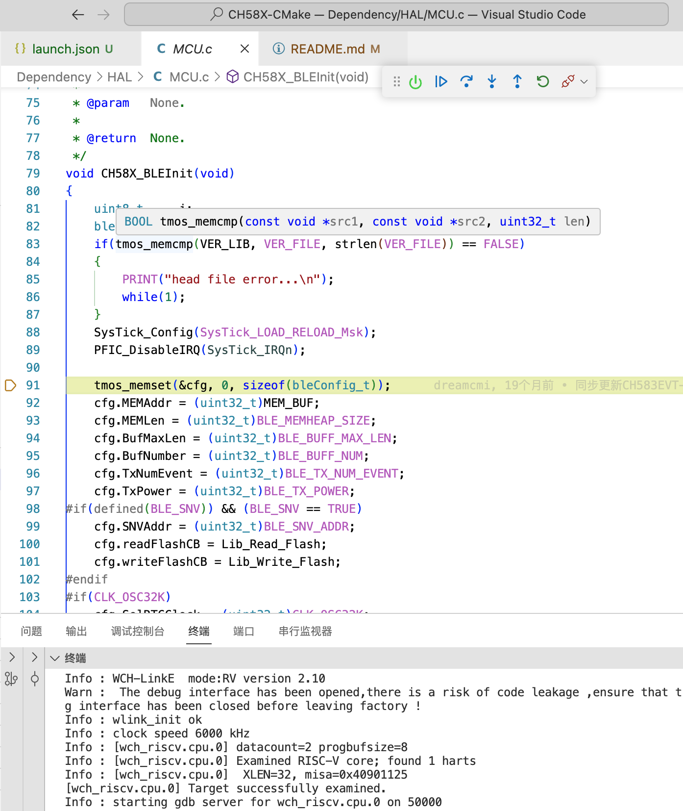

# CH58X-CMake

## 编译

摆脱eclipse编译环境，使用vscode编辑代码。

此仓库为cmake模板，请根据自己的工程进行适当修改。

请在CmakeLists.txt文件内更改`TOOLPATH`的变量为你的工具链路径。

使用脚本编译：

```shell
sh build.sh
```

如果是手动编译，可选择如下两个方法


```shell
A和B方法任选其一即可

A、使用cmake生成eclipse Makefile工程
cmake -G"Eclipse CDT4 - Unix Makefiles" ..
如果没有把make.exe加入系统path:
cmake -G"Eclipse CDT4 - Unix Makefiles" -D"你的路径/make.exe"  ..

B、使用cmake生成ninja工程
cmake -G"Ninja" ..
如果没有把ninja.exe加入系统path:
cmake -G"Ninja" -D"你的路径/ninja.exe" ..
```

## 调试
Mac OS M芯片平台：

### Tips :
- WCH-Link :需要设置好正确的模式

    （[说明中文版](https://www.wch.cn/downloads/WCH-LinkUserManual_PDF.html))([LinkUserManual](https://www.wch-ic.com/downloads/WCH-LinkUserManual_PDF.html))

    如果是ARM架构的芯片，则设置为ARM模式，否则需要设置为RISC-V模式

- 安装好 libusb驱动

    在MBA下，需要安装Apple版 + Intel版的 libusb驱动（因为沁恒的OpenOCD依赖的是Intel的libusb）

- 把WCH-Link 连接好芯片，然后芯片开启两线仿真，并且把开发板连接到电脑

- 安装cortex-debug 1.4.4版本

    因为沁恒使用的是GCC8，1.4.4版本是最后兼容GCC8的版本了。


---

最后就可以Debug了


